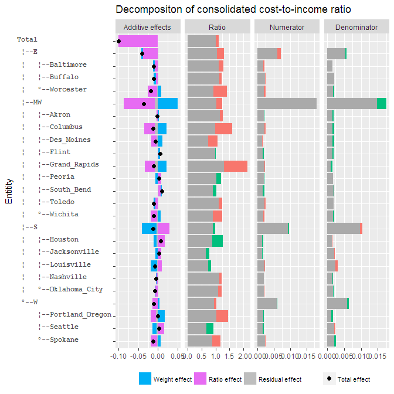

<!-- README.md is generated from README.Rmd. Please edit that file -->
hierarchical
============

`hierarchical` provides tools for manipulations, transformations and analysis of hierarchical data

Example of decomposition of financial ratios
--------------------------------------------

### Simulate random data

``` r
library(data.table)
library(data.tree)

# load example data
data("Angell", package = "car")
DT <- as.data.table(Angell, keep.rownames = TRUE)[sample(1:.N, 20)]
setnames(DT, "rn", "name")

# simulate financial data
DT <- rbindlist(list("2016" = DT, "2007" = DT), idcol = "year")
DT[, cost   := 1000*rgamma(.N, 30, 30)]
DT[, income := 1000*rgamma(.N, 31, 31)]

# compute first differences
setkey(DT, region, name, year)
DT[, cost_diff   := c(NA, diff(cost)),   by = .(region, name)]
DT[, income_diff := c(NA, diff(income)), by = .(region, name)]
DT[, cost_to_income := cost / income]
```

### Convertion of data.table into a data.tree

``` r
library(hierarchical)

tree <- dt2tree_ratio(DT, 
                      tree_name       = "Total", 
                      numerator_name  = "cost", 
                      denomiator_name = "income", 
                      dim_names       = c("region", "name"))
```

### Decomposition of ratios

``` r
tree$Do(decomp_ratios_root_full, 
        root_denominator_curr = tree$denominator_curr,
        root_denominator_lag  = tree$denominator_lag, 
        multipl = 1)
```

### Output

You can print "ratio\_effect", "weight\_effect" and "residual\_effect" using `data.tree` methods:

``` r
print(tree, "ratio_curr", "ratio_effect", "weight_effect")
#>                  levelName ratio_curr  ratio_effect weight_effect
#> 1  Total                    1.0125368 -0.1003213546  0.0000000000
#> 2   ¦--E                    1.0481072 -0.0374074297 -0.0043628947
#> 3   ¦   ¦--Baltimore        1.1088967 -0.0079883251 -0.0041669694
#> 4   ¦   ¦--Buffalo          1.1370990 -0.0046427500 -0.0070280689
#> 5   ¦   °--Worcester        0.9139942 -0.0233091538  0.0079330930
#> 6   ¦--MW                   1.0384977 -0.0785724999  0.0497339999
#> 7   ¦   ¦--Akron            1.1609445 -0.0041389238  0.0026191731
#> 8   ¦   ¦--Columbus         0.9827053 -0.0255314615  0.0220401081
#> 9   ¦   ¦--Des_Moines       0.7334785 -0.0139630371  0.0105250588
#> 10  ¦   ¦--Flint            1.0156737  0.0007425603  0.0040221061
#> 11  ¦   ¦--Grand_Rapids     1.3110829 -0.0248994822  0.0222052305
#> 12  ¦   ¦--Peoria           1.2023394  0.0086175146 -0.0055021949
#> 13  ¦   ¦--South_Bend       1.0356526  0.0065359396  0.0033548430
#> 14  ¦   ¦--Toledo           1.1123677 -0.0066056195 -0.0051244048
#> 15  ¦   °--Wichita          0.8957126 -0.0164817340  0.0074272775
#> 16  ¦--S                    0.9943783  0.0282413658 -0.0364079191
#> 17  ¦   ¦--Houston          1.2708203  0.0173090422 -0.0075381081
#> 18  ¦   ¦--Jacksonville     0.7832499  0.0084321974 -0.0048687486
#> 19  ¦   ¦--Louisville       0.8436360  0.0104027554 -0.0162560296
#> 20  ¦   ¦--Nashville        1.1274330 -0.0041452515 -0.0009251232
#> 21  ¦   °--Oklahoma_City    1.0864080 -0.0061833015 -0.0015956766
#> 22  °--W                    0.9375951 -0.0139736693  0.0037597351
#> 23      ¦--Portland_Oregon  1.0360174 -0.0139492749  0.0176710699
#> 24      ¦--Seattle          0.9121410  0.0160770364 -0.0099144997
#> 25      °--Spokane          0.8890077 -0.0173739896  0.0073394267
```

...or print it using `ggplot2`

``` r
library(ggplot2)
# debug(plot_tree_ratio)
plot_tree_ratio(tree)  +
  ggtitle("Decompositon of consolidated cost-to-income ratio") +
  xlab("Entitity") + 
  theme(legend.text = element_text(size = 8))
#> Warning: Removed 6 rows containing missing values (position_stack).
```


